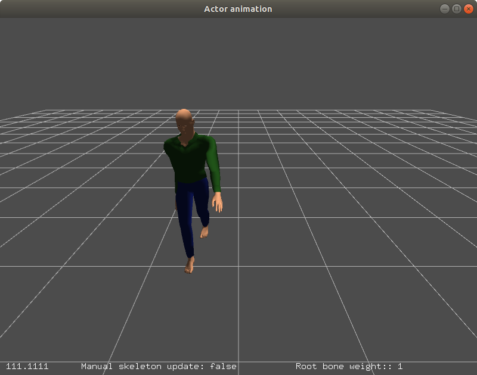

# Actor animation tutorial

This tutorial will show you how to use the Ignition Rendering library to create an actor animation.

## Code

In this section we will describe the main classes and methods used to create the actor. The basic steps are:

 - Create a visual for the actor
 - Attach mesh
 - Get skeleton
 - The skeleton will be animated by `GlutWindow`

Create a `Visual` pointer with the scene manager and set the position and rotation of the object:

```{.cpp}
VisualPtr actorVisual = _scene->CreateVisual("actor");
actorVisual->SetLocalPosition(3, 0, 0);
actorVisual->SetLocalRotation(0, 0, 0);
```

Create a `MeshDescriptor` class with the mesh name of the actor, then using the `MeshManager` Singleton class, load the mesh in the descriptor:

```{.cpp}
MeshDescriptor descriptor;
descriptor.meshName = common::joinPaths(RESOURCE_PATH, "walk.dae");

common::MeshManager *meshManager = common::MeshManager::Instance();
descriptor.mesh = meshManager->Load(descriptor.meshName);
```
Finally, attach the mesh to the visual:

```{.cpp}
_mesh = _scene->CreateMesh(descriptor);
actorVisual->AddGeometry(_mesh);
```

We can check if the mesh has a skeleton. This will allows us to check if we can animate the actor in the scene:

```{.cpp}
if (_mesh && descriptor.mesh->HasSkeleton())
{
  _skel = descriptor.mesh->MeshSkeleton();

  if (!_skel || _skel->AnimationCount() == 0)
  {
    std::cerr << "Failed to load animation." << std::endl;
    return;
  }
}
```

There are two main function in the `GlutWindow.c` file:

 - **void initAnimation()**: This function will check if the skeleton has an animation. Then it will load the animation using a `bvh` file (an animation file format).
 
```{.cpp}
if (!g_skel || g_skel->AnimationCount() == 0)
{
  std::cerr << "Failed to load animation." << std::endl;
  return;
}
const std::string RESOURCE_PATH =
    ic::joinPaths(std::string(PROJECT_BINARY_PATH), "media");
std::string bvhFile = ic::joinPaths(RESOURCE_PATH, "cmu-13_26.bvh");
double scale = 0.055;
g_skel->AddBvhAnimation(bvhFile, scale);
```

And finally, the animation will be initialized:

```{.cpp}
g_skelAnim = g_skel->Animation(g_animIdx);
```
 - **void updatePose()**: This function will update the skeleton over the time to create the animation of the actor.
```{.cpp}
...
  std::string skinName = g_skel->NodeNameAnimToSkin(g_animIdx, animName);
  ignition::math::Matrix4d skinTf =
          g_skel->AlignTranslation(g_animIdx, animName)
          * animTf * g_skel->AlignRotation(g_animIdx, animName);
...
}
g_mesh->SetSkeletonLocalTransforms(skinFrames);
```

## Compile and run the example

Create a build directory and use `cmake` and `make` to compile the code:

```{.sh}
cd ign-rendering/examples/actor_animation
mkdir build
cd build
cmake ..
make
```

When the code is compiled you can execute the example with the following command. Using the left and right button of the mouse you can move around the scene and even zoom in and out.

```{.sh}
./actor_animation
```


