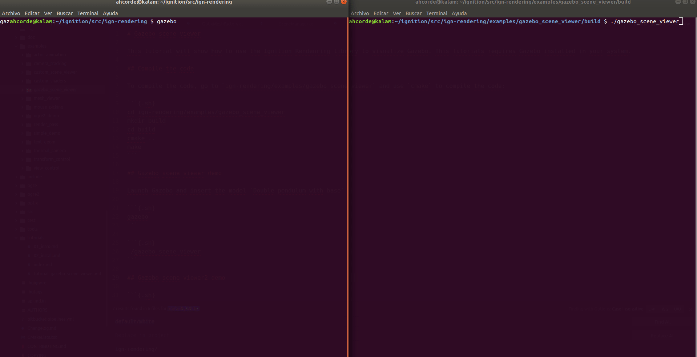

# Gazebo scene viewer

The Gazebo scene viewer examples allow us to visualize Gazebo using the Ignition Rendering library.

## Code

The `SceneManager` class defined in `SceneManager.hh`, `SceneManagerPrivate.hh` and `SceneManager.cc` manages a collection of scenes. 
The class provides a single interface for modifications, allowing multiple scenes to stay synchronized. 
It will allow us to receive data from Gazebo and update the render window each time that the examples receive a new scene. **This class currently consumes Gazebo-specified protobuf messages**.

The following list will describe some methods:

 - **void SceneManagerPrivate::Init()**: It initializes the communication with Gazebo. It will create some subscribers to receive data about poses, light, models, joints, visual or sensors.
```{.cpp}
      this->preRenderConn = gazebo::event::Events::ConnectPreRender(
            std::bind(&SceneManagerPrivate::UpdateScenes, this));
      // setup transport communication node
      this->transportNode = gazebo::transport::NodePtr(
          new gazebo::transport::Node());
      this->transportNode->Init();
      // create publisher for sending scene request
      this->requestPub =
          this->transportNode->Advertise<gazebo::msgs::Request>("~/request");
      // listen for deletion requests
      this->requestSub = this->transportNode->Subscribe("~/request",
         &SceneManagerPrivate::OnRequest, this);
      // listen for scene & deletion requests responses
      this->responseSub = this->transportNode->Subscribe("~/response",
          &SceneManagerPrivate::OnResponse, this);
      // listen for to light updates
      this->lightSub = this->transportNode->Subscribe("~/light",
          &SceneManagerPrivate::OnLightUpdate, this);
      // TODO(anyone): handle non-local model info
      // listen for to model updates
      this->modelSub = this->transportNode->Subscribe("~/model/info",
          &SceneManagerPrivate::OnModelUpdate, this);
      // listen for to joint updates
      this->jointSub = this->transportNode->Subscribe("~/joint",
          &SceneManagerPrivate::OnJointUpdate, this);
      // listen for to visual updates
      this->visualSub = this->transportNode->Subscribe("~/visual",
          &SceneManagerPrivate::OnVisualUpdate, this);
      // listen for to sensor updates
      this->sensorSub = this->transportNode->Subscribe("~/sensor",
          &SceneManagerPrivate::OnSensorUpdate, this);
      // TODO(anyone): handle non-local pose info
      // listen for to pose updates
      this->poseSub = this->transportNode->Subscribe("~/pose/local/info",
          &SceneManagerPrivate::OnPoseUpdate, this);
```

 - **void SubSceneManager::ProcessMessages()**: This method will process the messages received from Gazebo. Calling the right primitive to render lights, models, joints, visuals, sensors or poses of the different object received.
```{.cpp}
void SubSceneManager::ProcessMessages()
{
      // process each queued message
      this->ProcessLights();
      this->ProcessModels();
      this->ProcessJoints();
      this->ProcessVisuals();
      this->ProcessSensors();
      this->ProcessPoses();
      this->ProcessRemovals();

      // flush changes to scene
      this->activeScene->SetSimTime(this->timePosesReceived);
      this->activeScene->PreRender();
}
```
 For example, if the Gazebo scene contains a cylinder the following method will be called:
```{.cpp}
void SubSceneManager::ProcessCylinder(
    const gazebo::msgs::Geometry &_geometryMsg, VisualPtr _parent)
{
      GeometryPtr cylinder = this->activeScene->CreateCylinder();
      const gazebo::msgs::CylinderGeom &cylinderMsg = _geometryMsg.cylinder();
      double x = 2 * cylinderMsg.radius();
      double y = 2 * cylinderMsg.radius();
      double z = cylinderMsg.length();
      _parent->SetLocalScale(x, y, z);
      _parent->AddGeometry(cylinder);
}
```

 - **void CurrentSceneManager::OnPoseUpdate(::ConstPosesStampedPtr &_posesMsg)**: This method is called when the subscriber receives a new pose message.
```
void CurrentSceneManager::OnPoseUpdate(::ConstPosesStampedPtr &_posesMsg)
{
    ...
    // process each pose in message
    for (int i = 0; i < _posesMsg->pose_size(); ++i)
    {
      // replace into pose map
      gazebo::msgs::Pose pose = _posesMsg->pose(i);
      std::string name = pose.name();
      this->poseMsgs[name] = pose;
    }
}
```

## Compile and run the example

Create a build directory and use `cmake` and `make` to compile the code:

```{.sh}
cd ign-rendering/examples/gazebo_scene_viewer
mkdir build
cd build
cmake ..
make
```

### gazebo_scene_viewer

Launch Gazebo and insert `Double pendulum with base`:

```{.sh}
gazebo
```

Launch the example to visualize the pendulum:

```{.sh}
./gazebo_scene_viewer
```

You can use the `Tab` button to change the rendering engine.



#### gazebo_scene_viewer2_demo

Launch Gazebo using the world inside the example directory called `falling_objects.world`. You will see some objects falling.

```{.sh}
gazebo examples/gazebo_scene_viewer/falling_objects.world
```

Launch the example to visualize the objects:

```{.sh}
./gazebo_scene_viewer2_demo
```

You can use the `Tab` button to change the rendering engine.


