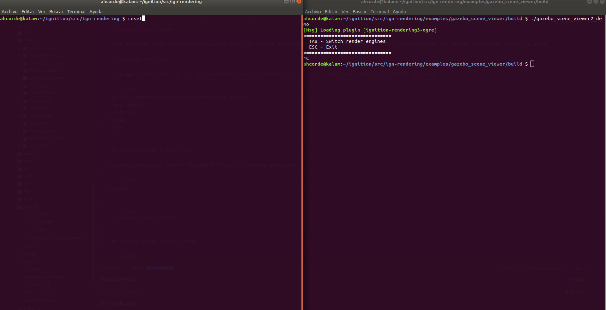

\page gazebo_scene_viewer Gazebo scene viewer

The Gazebo scene viewer examples allow us to visualize Gazebo simulation using the Ignition Rendering library.

## Compile and run the example

Clone the source code, create a build directory and use `cmake` and `make` to compile the code:

```{.sh}
git clone https://github.com/ignitionrobotics/ign-rendering
cd ign-rendering/examples/gazebo_scene_viewer
mkdir build
cd build
cmake ..
make
```

### gazebo_scene_viewer

Launch Gazebo and insert `Double pendulum with base`:

```{.sh}
gazebo
```

Launch the example to visualize the pendulum:

```{.sh}
./gazebo_scene_viewer
```

You can use the `Tab` button to change the rendering engine.

@image html img/gazebo_scene_viewer.gif

#### gazebo_scene_viewer2_demo

Launch Gazebo using the world inside the example directory called `falling_objects.world`. You will see some objects falling.

```{.sh}
gazebo examples/gazebo_scene_viewer/falling_objects.world
```

Launch the example to visualize the objects:

```{.sh}
./gazebo_scene_viewer2_demo
```

You can use the `Tab` button to change the rendering engine.



## Code

The `SceneManager` class defined in `SceneManager.hh`, `SceneManagerPrivate.hh` and `SceneManager.cc` manages a collection of scenes.
The class provides a single interface for modifications, allowing multiple scenes to stay synchronized.
It will allow us to receive data from Gazebo and update the render window each time that the examples receive a new scene. **This class currently consumes Gazebo-specific protobuf messages**.

The following list will describe some methods:

 - **void SceneManagerPrivate::Init()**: It initializes the communication with Gazebo. It will create some subscribers to receive data about poses, light, models, joints, visual or sensors.

\snippet examples/gazebo_scene_viewer/SceneManager.cc init scene manager

 - **void SubSceneManager::ProcessMessages()**: This method will process the messages received from Gazebo. Calling the right primitive to render lights, models, joints, visuals, sensors or poses of the different object received.
\snippet examples/gazebo_scene_viewer/SceneManager.cc process message
 For example, if the Gazebo scene contains a cylinder the following method will be called:
\snippet examples/gazebo_scene_viewer/SceneManager.cc process cylinder

 - **void CurrentSceneManager::OnPoseUpdate(::ConstPosesStampedPtr &_posesMsg)**: This method is called when the subscriber receives a new pose message.
\snippet examples/gazebo_scene_viewer/SceneManager.cc on update pose
