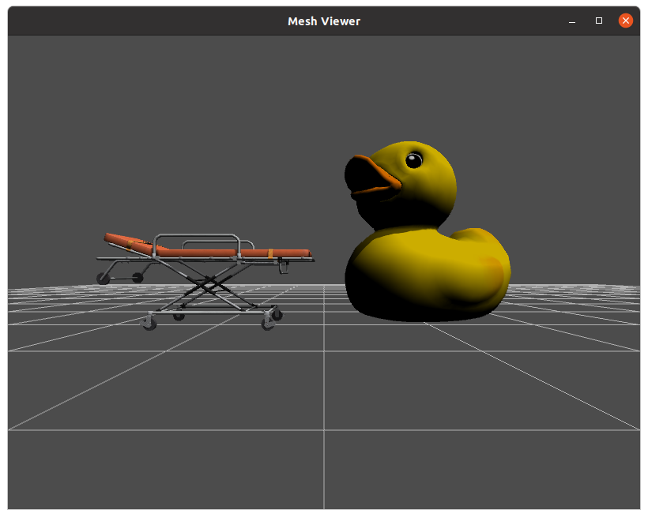

# Mesh Viewer

## Compile and run the example

Create a build directory and use `cmake` and `make` to compile the code:

```{.sh}
cd ign-rendering/examples/mesh_viewer
mkdir build
cd build
cmake ..
make
```

To run the example:

```{.sh}
./mesh_viewer
```



# Code

In the the `Main.cc` file there is a function called `buildScene` which is in charge of creating the objects in the scene (for example: the grid or the duck). 
The steps to visualize a mesh are the following:

  - Create a visual
  - Attach mesh to the visual
  - Include the visual in the scene

```
// create a mesh
VisualPtr mesh = _scene->CreateVisual();
mesh->SetLocalPosition(3, 0, 0);
mesh->SetLocalRotation(1.5708, 0, 2.0);
MeshDescriptor descriptor;
descriptor.meshName = common::joinPaths(RESOURCE_PATH, "duck.dae");
common::MeshManager *meshManager = common::MeshManager::Instance();
descriptor.mesh = meshManager->Load(descriptor.meshName);
MeshPtr meshGeom = _scene->CreateMesh(descriptor);
mesh->AddGeometry(meshGeom);
root->AddChild(mesh);
```

Similarly, we can add a grid to the floor:

```{.cpp}
// create grid visual
VisualPtr grid = _scene->CreateVisual();
GridPtr gridGeom = _scene->CreateGrid();
gridGeom->SetCellCount(20);
gridGeom->SetCellLength(1);
gridGeom->SetVerticalCellCount(0);
grid->AddGeometry(gridGeom);
grid->SetLocalPosition(3, 0, 0.0);
grid->SetMaterial(gray);
root->AddChild(grid);
```

Or we can include a camera and set up the position, orientation, dimensions and other relevant features of cameras:

```{.cpp}
// create camera
CameraPtr camera = _scene->CreateCamera("camera");
camera->SetLocalPosition(0.0, 0.0, 0.5);
camera->SetLocalRotation(0.0, 0.0, 0.0);
camera->SetImageWidth(800);
camera->SetImageHeight(600);
camera->SetAntiAliasing(2);
camera->SetAspectRatio(1.333);
camera->SetHFOV(IGN_PI / 2);
root->AddChild(camera);
