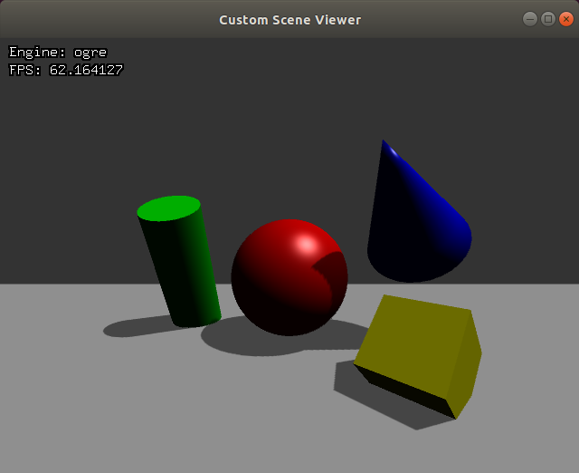

# Custom scene viewer

When the application starts we will see a blank window, this application allows us to view a number of pre constructed scenes. The initial render engine is Ogre, when we click on `+` or `-` buttons we can change the scene. By pressing the `Tab` button we will advance the next render engine. You may see how the render engine title in the window will change to Optix if you have compiled you Ignition Rendering Library with OptiX (Otherwise you will only can use Ogre) also the frame rate may change based on your computer capabilities.

The following scenes have more primitive objects such us cones or cilinders. Again we can see the scene with different render engines pressing `Tab`.

Some of the scene availables will include:

 - Textures
 - Normal mapping
 - Reflective property
 - Soft shadows

There are some scenes that are not available in Ogre because we have not or we can not implement it in Ogre.

# Compile and run the example

Create a build directory and use `cmake` and `make` to compile the code:

```{.sh}
cd ign-rendering/examples/custom_scene_viewer
mkdir build
cd build
cmake ..
make
```

To run the example:

```{.sh}
./custom_scene_viewer
```



# Code

In the main function we can have a look to all the scenes defined:

```{.cpp}
...
    sceneDemo->AddScene(SceneBuilderPtr(new SceneBuilder));
    sceneDemo->AddScene(SceneBuilderPtr(new SimpleSceneBuilder));
    sceneDemo->AddScene(SceneBuilderPtr(new AllShapesSceneBuilder));
    sceneDemo->AddScene(SceneBuilderPtr(new TextureSceneBuilder));
    sceneDemo->AddScene(SceneBuilderPtr(new NormalMapSceneBuilder));
    sceneDemo->AddScene(SceneBuilderPtr(new ReflectionSceneBuilder));
    sceneDemo->AddScene(SceneBuilderPtr(new NormalReflectionSceneBuilder));
    sceneDemo->AddScene(SceneBuilderPtr(new ShadowSceneBuilder(1)));
    sceneDemo->AddScene(SceneBuilderPtr(new ShadowSceneBuilder(2)));
    sceneDemo->AddScene(SceneBuilderPtr(new ShadowSceneBuilder(3)));
    sceneDemo->AddScene(SceneBuilderPtr(new ShadowSceneBuilder(4)));
    sceneDemo->AddScene(SceneBuilderPtr(new ShadowSceneBuilder(5)));
...
```

Inside `SceneBuilder.cc` there are define some classes which create the world. The method `BuildScene` will create the world for each scene.

For example, we can have a look to the `SimpleSceneBuilder` class inside `SceneBuilder.cc`. This class will only define the floor, the sphere and the light.

```{.cpp}
void SimpleSceneBuilder::BuildScene(ScenePtr _scene)
{
  SceneBuilder::BuildScene(_scene);
  VisualPtr root = _scene->RootVisual();
  _scene->SetAmbientLight(0.1, 0.1, 0.1);

  DirectionalLightPtr light = _scene->CreateDirectionalLight(LIGHT);
  light->SetDirection(0.3, 0.5, -1.0);
  light->SetDiffuseColor(0.8, 0.8, 0.8);
  light->SetSpecularColor(0.8, 0.8, 0.8);
  root->AddChild(light);

  VisualPtr sphere = _scene->CreateVisual(SPHERE);
  sphere->AddGeometry(_scene->CreateSphere());
  sphere->SetLocalPosition(3.0, 0.0, 0.5);
  sphere->SetLocalRotation(0.0, 0.0, 0.0);
  sphere->SetMaterial("Red");
  root->AddChild(sphere);

  VisualPtr plane = _scene->CreateVisual(PLANE);
  plane->AddGeometry(_scene->CreatePlane());
  plane->SetLocalPosition(3.0, 0.0, 0.0);
  plane->SetLocalRotation(0.0, 0.0, 0.0);
  plane->SetLocalScale(5.0, 10.5, 1.0);
  plane->SetMaterial("White");
  root->AddChild(plane);
}
```

`AllShapesSceneBuilder` class inside `SceneBuilder.cc`. It will define more objects such us: `CYLINDER`, `CONE` or `BOX`.

```{.cpp}
void AllShapesSceneBuilder::BuildScene(ScenePtr _scene)
{
  SimpleSceneBuilder::BuildScene(_scene);
  VisualPtr root = _scene->RootVisual();

  VisualPtr cylinder = _scene->CreateVisual(CYLINDER);
  cylinder->AddGeometry(_scene->CreateCylinder());
  cylinder->SetLocalPosition(3.3, 1.0, 0.5);
  cylinder->SetLocalRotation(0.0, -0.5, 0.0);
  cylinder->SetLocalScale(0.5, 0.5, 1.5);
  cylinder->SetMaterial("Green");
  root->AddChild(cylinder);

  VisualPtr cone = _scene->CreateVisual(CONE);
  cone->AddGeometry(_scene->CreateCone());
  cone->SetLocalPosition(2.6, -0.8, 1.2);
  cone->SetLocalRotation(-0.5, -0.75, 0.0);
  cone->SetLocalScale(0.8, 0.8, 1.0);
  cone->SetMaterial("Blue");
  root->AddChild(cone);

  VisualPtr box = _scene->CreateVisual(BOX);
  box->AddGeometry(_scene->CreateBox());
  box->SetLocalPosition(2.2, -0.8, 0.2);
  box->SetLocalRotation(IGN_PI / 4, 0.0, IGN_PI / 4);
  box->SetLocalScale(0.5, 0.5, 0.5);
  box->SetMaterial("Yellow");
  root->AddChild(box);
}
```

The class `TextureSceneBuilder` will include all the objects and the textures:

```{.cpp}
void TextureSceneBuilder::BuildScene(ScenePtr _scene)
{
  AllShapesSceneBuilder::BuildScene(_scene);

  VisualPtr box = _scene->VisualByName(BOX);
  box->SetMaterial("TextureYellow");

  VisualPtr cone = _scene->VisualByName(CONE);
  cone->SetMaterial("TextureBlue");

  VisualPtr cylinder = _scene->VisualByName(CYLINDER);
  cylinder->SetMaterial("TextureGreen");

  VisualPtr plane = _scene->VisualByName(PLANE);
  plane->SetMaterial("TextureWhite");

  VisualPtr sphere = _scene->VisualByName(SPHERE);
  sphere->SetMaterial("TextureRed");
}
```

The class `NormalMapSceneBuilder` will include all the objects, the textures and the normal maps:

```{.cpp}
void NormalMapSceneBuilder::BuildScene(ScenePtr _scene)
{
  TextureSceneBuilder::BuildScene(_scene);

  VisualPtr box = _scene->VisualByName(BOX);
  box->SetMaterial("NormalYellow");

  VisualPtr cone = _scene->VisualByName(CONE);
  cone->SetMaterial("NormalBlue");

  VisualPtr cylinder = _scene->VisualByName(CYLINDER);
  cylinder->SetMaterial("NormalGreen");

  VisualPtr plane = _scene->VisualByName(PLANE);
  plane->SetMaterial("NormalWhite");

  VisualPtr sphere = _scene->VisualByName(SPHERE);
  sphere->SetMaterial("NormalRed");
}
```
