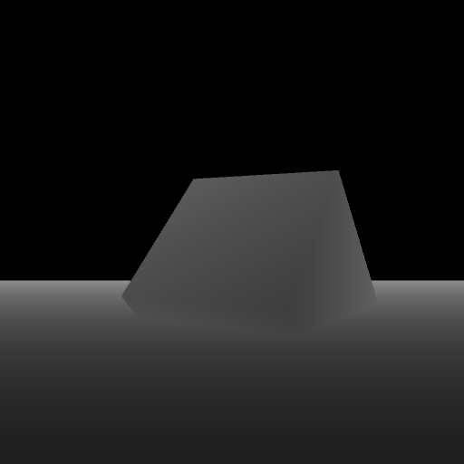

# Custom shaders

This example will create two images (RGB and Depth) based on the scene. The scene will allow us to introduce shaders from a file.

# Compile and run the example

Create a build directory and use `cmake` and `make` to compile the code:

```{.sh}
cd ign-rendering/examples/camera_tracking
mkdir build
cd build
cmake ..
make
```

```
./camera_tracking
Image saved: depth.png
Image saved: regular.png
```




# Code

In the first lines of the `custom_shaders.cc` file there are some constants defined with the name of the shaders that the scene will use:

```{.cpp}
const std::string depth_vertex_shader_file =
  "depth_vertex_shader.glsl";
const std::string depth_fragment_shader_file =
  "depth_fragment_shader.glsl";
const std::string vertex_shader_file = "vertex_shader.glsl";
const std::string fragment_shader_file = "fragment_shader.glsl";
```

We can use the environment variable `IGN_RENDERING_RESOURCE_PATH` to define where are these files located. The code will add to this path some directories (/ogre/media/materials/programs/):

```{.cpp}
const char *env = std::getenv("IGN_RENDERING_RESOURCE_PATH");
std::string resourcePath = (env) ? std::string(env) :
    IGN_RENDERING_RESOURCE_PATH;

// path to look for vertex and fragment shader parameters
std::string vertex_shader_path = ignition::common::joinPaths(
    resourcePath, "ogre", "media", "materials", "programs",
    vertex_shader_file);

std::string fragment_shader_path = ignition::common::joinPaths(
    resourcePath, "ogre", "media", "materials", "programs",
    fragment_shader_file);
```

Then the shaders will be apply on the object's material:

```{.cpp}
ignition::rendering::MaterialPtr shader = _scene->CreateMaterial();
shader->SetVertexShader(vertex_shader_path);
shader->SetFragmentShader(fragment_shader_path);
```
