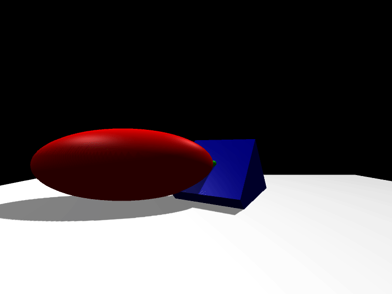

# Simple demo

This example shows how move the camera automatically.

# Compile and run the example

Create a build directory and use `cmake` and `make` to compile the code:

```{.sh}
cd ign-rendering/examples/simple_demo
mkdir build
cd build
cmake ..
make
```
Excute the example:

```{.sh}
./simple_demo
[Msg] Loading plugin [ignition-rendering4-ogre]
Engine 'optix' is not supported
===============================
  TAB - Switch render engines  
  ESC - Exit                   
===============================
```



# Code

The function `updateCameras()` is called each time the `DisplayCB` function runs. Using the method `SetLocalPosition` from the `Camera` class we can locate the camera in the world:

```{.cpp}
//////////////////////////////////////////////////
void updateCameras()
{
  for (ir::CameraPtr camera : g_cameras)
  {
    camera->SetLocalPosition(g_offset, g_offset, g_offset);
  }

  g_offset+= 0.001;
}
```
